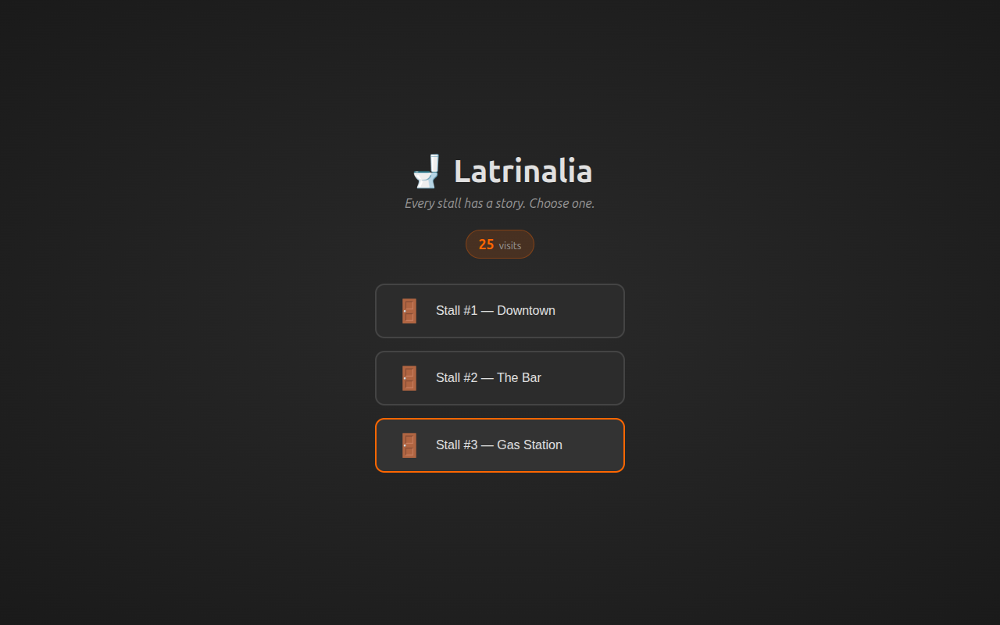
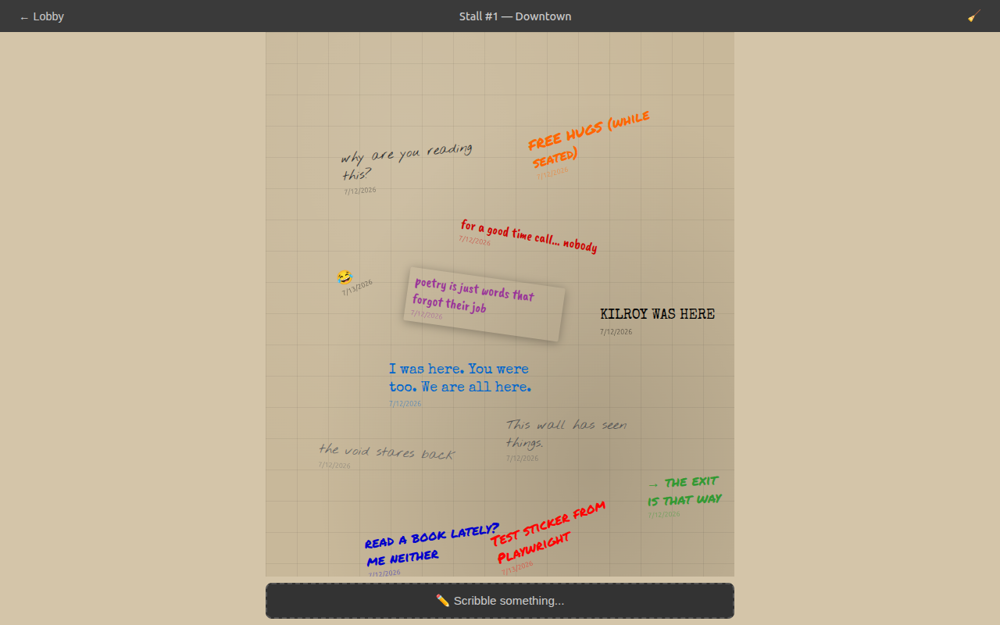
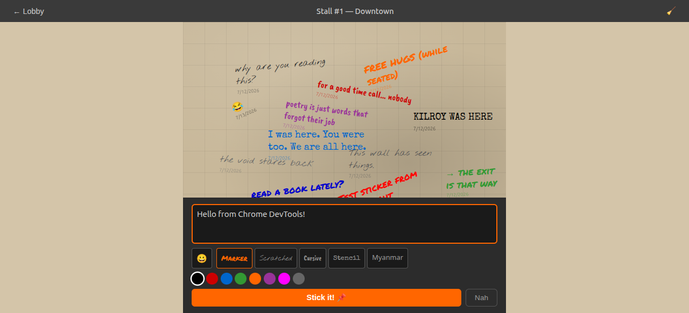
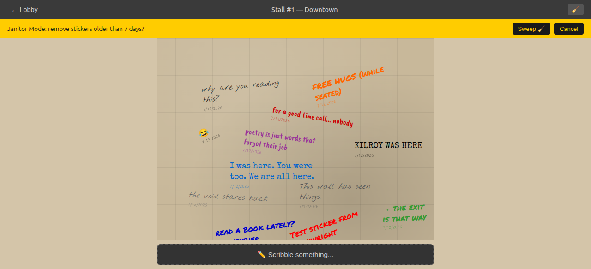
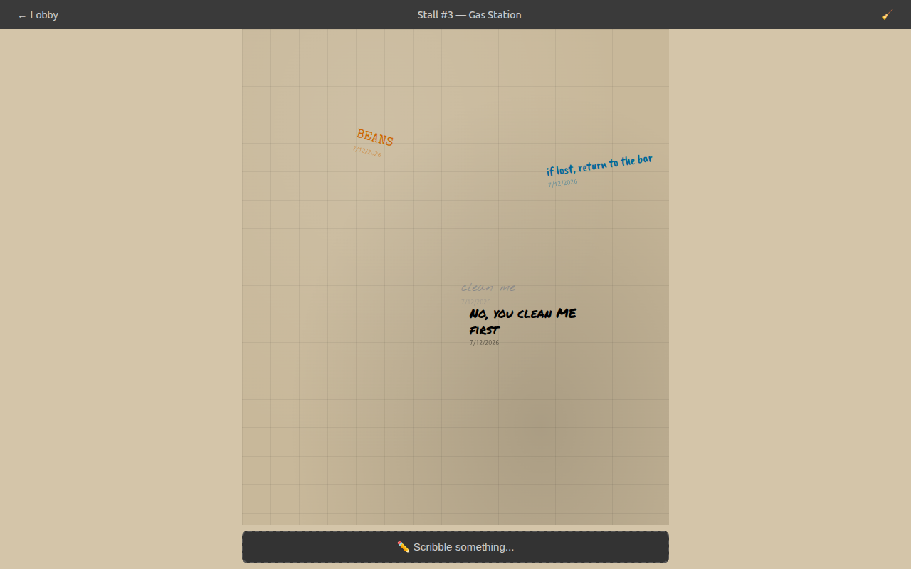
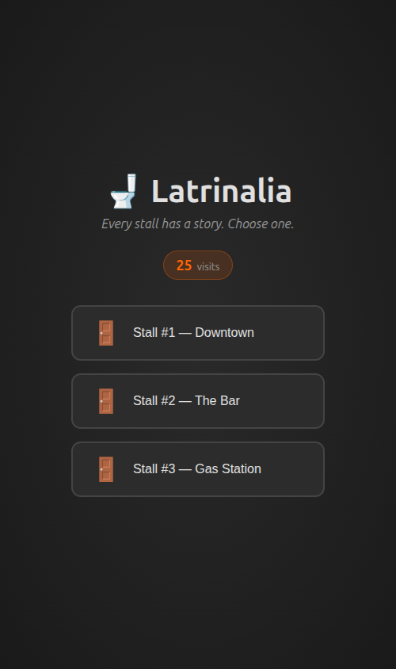
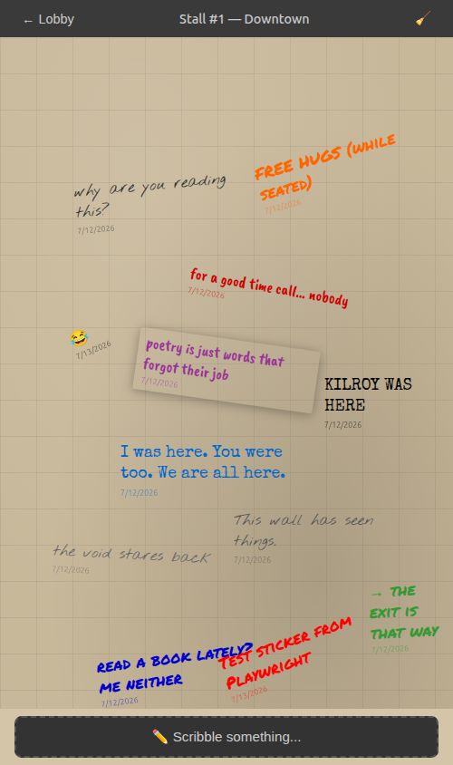
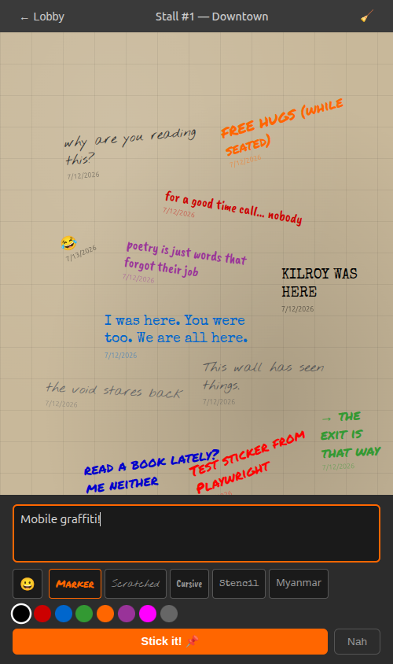
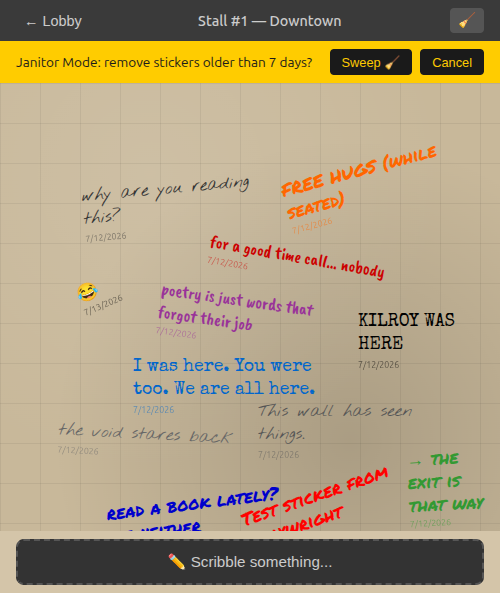
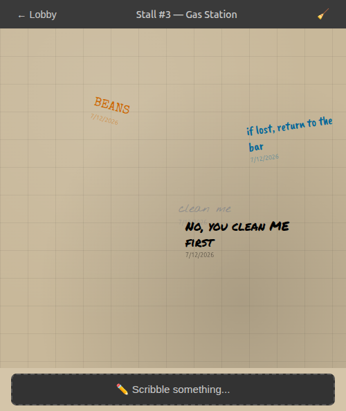

# 🚽 Latrinalia — Digital Toilet Graffiti Wall

[](https://nanaungoo.dpdns.org)
[](./LICENSE)
[](https://workers.cloudflare.com)
[](https://react.dev)

A Progressive Web App that brings the age-old culture of anonymous toilet graffiti into the digital age. Drop text stickers on virtual stall doors, drag them around, and let the next person find your message.

**🔗 Live:** [nanaungoo.dpdns.org](https://nanaungoo.dpdns.org)

## Features

- 🚻 **Anonymous graffiti** — Write anything, no login required
- 😀 **Emoji picker** — Add emojis to your stickers
- 🇲🇲 **Myanmar font support** — Write in မြန်မာစာ with Noto Sans Myanmar
- 👆 **Drag & drop** — Move stickers anywhere on the wall
- 🧹 **Janitor mode** — Auto-clean old stickers
- 📊 **Analytics** — Visit counter and sticker stats
- 📱 **PWA** — Install on your phone like a native app
- 🌙 **Dark theme** — Easy on eyes at night

## Screenshots

> Captured with Chrome DevTools at fixed resolutions.
> **Desktop:** 1280 × 800 · **Mobile:** 390 × 844

### Desktop (1280 × 800)

| Lobby | Stall Wall | Compose | Janitor | Another Stall |
|-------|------------|---------|---------|---------------|
|  |  |  |  |  |

### Mobile (390 × 844)

| Lobby | Stall Wall | Compose | Janitor | Another Stall |
|-------|------------|---------|---------|---------------|
|  |  |  |  |  |

## How it works

1. Pick a stall from the lobby
2. Scribble your anonymous text — pick a font, a color, and slap it on the door
3. Use the 😀 button to add emojis to your graffiti
4. Choose Myanmar font (🇲🇲) for မြန်မာစာ text
5. Drag any sticker to reposition it anywhere on the canvas
6. A janitor sweeps old stickers periodically so the wall stays fresh

## Tech stack

| Layer | What |
|-------|------|
| Frontend | React 18 + Vite (canvas-based drag-and-drop via `react-draggable`) |
| Backend | Cloudflare Workers (edge-native REST API) |
| Database | [Cloudflare D1](https://developers.cloudflare.com/d1/) (serverless SQLite) |
| Runtime | [Cloudflare Workers](https://workers.cloudflare.com/) — global edge network |
| AI tooling | Claude Code with D1 MCP server, a graffiti-wall skill, and a sticker-reviewer content-moderation agent |
| PWA | `manifest.json` + 192/512px icons — installable from Chrome |
| CI/CD | GitHub Actions → Cloudflare Workers (auto-deploy on push to `main`) |

## Project structure

```
.
├── index.html              # Vite entry point
├── vite.config.js          # Vite + React plugin
├── wrangler.toml           # Cloudflare Workers config (D1 binding)
├── .mcp.json               # D1 MCP server config for Claude
├── package.json
├── public/
│   ├── manifest.json       # PWA manifest
│   ├── icon-192.png
│   └── icon-512.png
├── src/
│   ├── worker/
│   │   ├── index.js            # Cloudflare Worker entry (router)
│   │   ├── middleware/
│   │   │   └── rateLimit.js    # IP-based rate limiting
│   │   └── routes/
│   │       ├── toilets.js      # Toilets CRUD
│   │       ├── stickers.js     # Stickers CRUD + janitor
│   │       └── analytics.js    # Event tracking + visit counter
│   ├── main.jsx            # React entry point
│   ├── App.jsx             # Lobby → StallCanvas router (with visit counter)
│   ├── index.css           # Global styles (dark stall theme)
│   ├── lib/
│   │   └── api.js          # fetch wrappers for the REST API
│   └── components/
│       ├── StallCanvas.jsx       # Canvas overlay with drag layer
│       ├── DraggableSticker.jsx  # Individual draggable text sticker
│       ├── StickerForm.jsx       # Compose new graffiti sticker
│       └── WelcomePopup.jsx      # First-time user instruction popup
├── server/                 # Legacy Express server (local dev fallback)
├── scripts/
│   └── db-init.js          # Seed script for dev/test data
├── dist/                   # Production build output
├── .github/
│   └── workflows/
│       └── deploy.yml      # Auto-deploy to Cloudflare Workers
└── .claude/
    ├── skills/graffiti-wall/SKILL.md   # Claude skill for managing stalls
    └── agents/sticker-reviewer.md      # Content-moderation Claude agent
```

## Getting started

```bash
# Install dependencies
npm install

# Start the Cloudflare Worker dev server (wrangler dev on :8787)
npm run dev

# Or run the Express fallback server (:3001)
npm run server

# Build the frontend for production
npm run build
```

> **Note:** The Vite dev server proxies `/api` requests to `http://localhost:8787` (Wrangler) or `http://localhost:3001` (Express fallback).

## Database

The production database uses Cloudflare D1. For local dev, Wrangler spins up a local D1 instance automatically.

```bash
# View database info and usage stats
npx wrangler d1 info latrinalia-db
```

Three default stalls are seeded on first request: Downtown, The Bar, and Gas Station.

## API

| Method | Path | Description |
|--------|------|-------------|
| `GET` | `/api/toilets` | List all stalls |
| `GET` | `/api/toilets/:id/stickers` | Get stickers on a stall (delete tokens excluded) |
| `POST` | `/api/toilets/:id/stickers` | Add a sticker (returns `delete_token`) |
| `DELETE` | `/api/stickers/:id` | Remove a sticker (requires `?delete_token=` or `X-Delete-Token` header) |
| `POST` | `/api/toilets/:id/janitor` | Sweep stickers older than N days (body: `{ "days": 7 }`) |
| `POST` | `/api/analytics` | Track a custom event |
| `GET` | `/api/analytics` | Get analytics summary (visit count, sticker stats) |

## Claude Code integration

This project uses three Claude Code features, all with real paths in the repo:

- **MCP** — [`.mcp.json`](.mcp.json): D1 server so Claude can query/modify the database directly
- **Skill** — [`.claude/skills/graffiti-wall/SKILL.md`](.claude/skills/graffiti-wall/SKILL.md): Bootstraps stalls, seeds test data, runs janitor mode, and handles migrations
- **Agent** — [`.claude/agents/sticker-reviewer.md`](.claude/agents/sticker-reviewer.md): Content moderation via haiku model — reviews graffiti and returns `keep | warn | remove` verdicts

## Deployment

This project is deployed on [Cloudflare Workers](https://workers.cloudflare.com/) + [D1](https://developers.cloudflare.com/d1/). Pushes to `main` auto-deploy via GitHub Actions.

```bash
# Deploy manually via CLI
npm run build
npx wrangler deploy
```

**GitHub secret required:**

| Secret | Description |
|--------|-------------|
| `CLOUDFLARE_API_TOKEN` | Cloudflare API token with Workers & D1 permissions |

**Cloudflare bindings:**

| Binding | Resource |
|---------|----------|
| `DB` | D1 Database (`latrinalia-db`) |

### Free plan limits

Cloudflare Workers free tier comfortably handles this app:

| Resource | Free Allowance | Typical Latrinalia Usage |
|----------|---------------|--------------------------|
| Worker requests | 100,000/day | negligible (< 100/day) |
| D1 storage | 5 GB | ~70 kB |
| D1 rows read | 5,000,000/month | ~2,000/month |
| D1 rows written | 100,000/month | ~400/month |

## Building for production

```bash
npm run build          # Outputs to dist/
npx wrangler dev       # Preview locally (frontend + Worker API)
npx wrangler deploy    # Deploy to Cloudflare's global edge network
```

The Cloudflare Worker serves the API and static assets directly at the edge.
