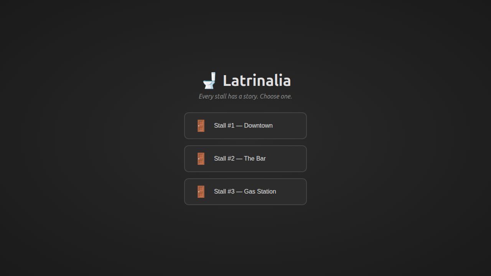
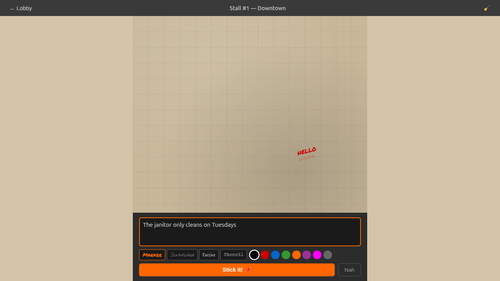
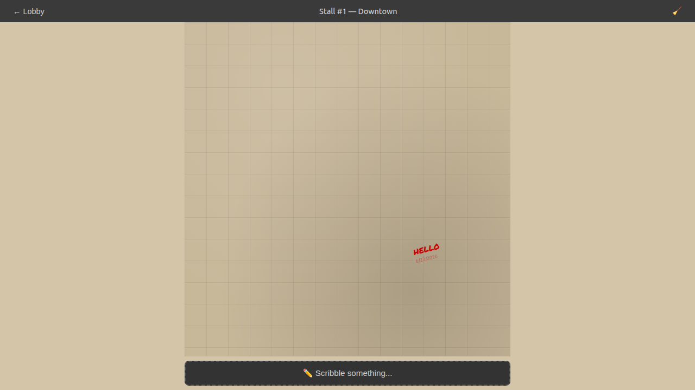

<!--
  Marp template — "burmese-first"
  မြန်မာစာအတွက် — Pyidaungsu / Noto Sans Myanmar ဖောင့်နဲ့ ချိန်ညှိထား။
  ကိုယ့် repo ထဲ ကူးထည့်ပါ (ဥပမာ slides/intro.md)၊ စာသားကို ပြောင်းပါ။
  Render:  marp slides/intro.md -o slides.html   (or .pdf / .png)
-->
---
marp: true
paginate: true
size: 16:9
---

<style>
@import url('https://fonts.googleapis.com/css2?family=Noto+Sans+Myanmar:wght@400;600;700&family=Inter:wght@400;600;800&display=swap');
:root { --bg:#fffdf9; --ink:#292524; --muted:#a8a29e; --accent:#d97706; --burnt:#9a3412; --line:#f1d9bf; --code:#1c1917; }
section {
  background:var(--bg); color:var(--ink);
  font-family:'Pyidaungsu','Noto Sans Myanmar','Inter',sans-serif;
  font-size:27px; line-height:1.7; padding:56px 72px;
}
h1 { color:var(--burnt); font-weight:700; border-bottom:4px solid var(--accent); padding-bottom:.2em; line-height:1.4; }
h2 { color:var(--accent); font-weight:600; line-height:1.5; }
h3 { color:var(--burnt); font-weight:600; }
strong { color:var(--burnt); }
a { color:#0369a1; text-decoration:none; }
ul,ol { line-height:1.7; }
code { background:#fff1e6; color:#be123c; padding:.06em .35em; border-radius:5px; font-family:'JetBrains Mono',ui-monospace,monospace; }
pre  { background:var(--code); border-radius:10px; }
pre code { background:none; color:#fde9d3; }
blockquote { border-left:4px solid var(--accent); background:#fffbeb; color:#57534e; padding:.5em 1em; }
table th { background:#fff1e6; color:var(--burnt); }
table td, table th { border-color:var(--line); }
header,footer,section::after { color:var(--muted); font-size:.5em; }
section.cover {
  background:linear-gradient(135deg,#7c2d12 0%, #b45309 50%, #d97706 100%);
  color:#fff7ed;
}
section.cover h1 { border-bottom:none; color:#fff7ed; font-size:2.1em; }
section.cover h2 { color:#ffedd5; font-weight:400; }
section.lead { background:linear-gradient(135deg,#fff7ed,#ffedd5); }
section.lead h1 { border-bottom:none; }
</style>

<!-- _class: cover -->

# 🚽 Latrinalia

## Anonymous toilet graffiti — digitised and preserved, one stall at a time

**NanAungOo** · @nanaungoo · latrinalia-production.up.railway.app

---

# What is this

- A digital toilet graffiti wall — anonymous sticker art on virtual stall doors
- For anyone who has ever scribbled on a bathroom wall, or read one
- Leave a message, pick a font and colour, drag it anywhere, and let the next person find it

---

# ဘယ်လို အလုပ်လုပ်လဲ

```bash
npm install
npm run dev
```

Stack — **React 18 · Express.js · SQLite · Vite** · Built with Claude Code

---

<!-- _class: lead -->

# Demo

| Lobby | Compose | Stall Wall |
|-------|---------|------------|
|  |  |  |

---

# Link များ

- **Live:** https://latrinalia-production.up.railway.app
- **Repo:** github.com/nanaungoo/latrinalia
- **License:** MIT
